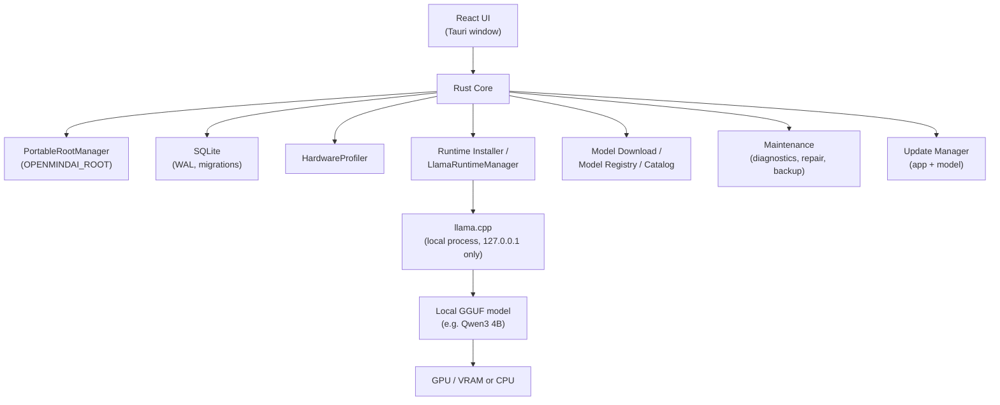

# OpenMindAI

### Your Private, Local, Offline AI Workspace

OpenMindAI is a local-first Windows desktop AI assistant. It downloads and
runs an open-weight language model directly on your computer — GPU
accelerated where available, CPU otherwise — and stores your conversations
in a local database you control. After a one-time setup, it works fully
offline. No OpenAI/Anthropic/Google API key, no cloud account, no
subscription.

## Key features

- **Runs locally** — chat, reasoning, and coding help powered by a model
  running on your own hardware, not a remote API.
- **Offline after setup** — see [docs/OFFLINE-MODE.md](docs/OFFLINE-MODE.md)
  for exactly what does and doesn't need internet.
- **Automatic hardware setup** — detects your CPU/GPU and installs the right
  AI engine build (CUDA, HIP, SYCL, Vulkan, or CPU fallback) for it.
- **No account, no cloud database** — a local SQLite database under a
  storage folder you pick during setup.
- **Persistent chat history** with streaming responses and cancellation.
- **Maintenance built in** — health diagnostics, one-button repair, database
  backups, and an in-app log viewer, all from Settings → Maintenance.
- **Update-aware** — checks for application and model updates in the
  background, never blocking offline use if you're not connected.

## Why OpenMindAI

Most AI chat apps are a thin client for someone else's cloud API — your
prompts and conversations leave your machine, and the assistant stops
working the moment you're offline or a subscription lapses. OpenMindAI
inverts that: the model runs on your computer, your conversations are
stored in a database you control, and internet is only needed for the
one-time download of the AI engine and model (and for optional update
checks afterward).

## How it works

1. **Download & run the installer.** No Node.js, npm, Rust, Cargo, or Git
   required — those are developer-setup tools, not end-user requirements.
2. **Pick a storage folder** for your AI data (`OPENMINDAI_ROOT`) and a
   local profile name.
3. **OpenMindAI configures itself** — creates the local database, detects
   your hardware, downloads and validates the right AI engine, then
   downloads and verifies the AI model.
4. **Start chatting**, fully offline from then on.

See [docs/INSTALLATION.md](docs/INSTALLATION.md) for the detailed walkthrough.

## Architecture



See [docs/ARCHITECTURE.md](docs/ARCHITECTURE.md) for the service-level
breakdown.

## System requirements

- Windows 10 or 11, 64-bit.
- ~5 GB free disk space (AI engine + model; more for additional models).
- Any CPU works (CPU-only fallback); a supported GPU (NVIDIA, AMD, or
  Intel) accelerates inference.
- Internet access for first-run setup and optional update checks.

## Download OpenMindAI

Grab the latest `OpenMindAI-Setup-x64.exe` from your release source, verify
it against the published `SHA256SUMS.txt` if you'd like, and see
[docs/INSTALLATION.md](docs/INSTALLATION.md) to continue. The installer is
currently unsigned (no code-signing certificate configured yet — see
[docs/RELEASE.md](docs/RELEASE.md)), so Windows SmartScreen will warn on
first run; that's expected.

## Models

OpenMindAI ships against **Qwen3 4B (Q4_K_M)** by default. Model weights are
never stored in this Git repository — they're downloaded and verified
during setup. See [docs/MODEL-MANAGEMENT.md](docs/MODEL-MANAGEMENT.md) for
how models are downloaded, verified, and (in the future) updated.

## Updates

OpenMindAI checks for application and model updates in the background so
you don't have to manually watch for new releases — see
[docs/UPDATES.md](docs/UPDATES.md) for exactly how that works today,
including what's still pending before it's fully live in production.

## Documentation

| Topic | Doc |
| --- | --- |
| Installing OpenMindAI | [docs/INSTALLATION.md](docs/INSTALLATION.md) |
| What works offline | [docs/OFFLINE-MODE.md](docs/OFFLINE-MODE.md) |
| Storage layout / `OPENMINDAI_ROOT` | [docs/PORTABLE-STORAGE.md](docs/PORTABLE-STORAGE.md) |
| The local database | [docs/DATABASE.md](docs/DATABASE.md) |
| The AI engine (llama.cpp) | [docs/AI-RUNTIME.md](docs/AI-RUNTIME.md) |
| Models | [docs/MODEL-MANAGEMENT.md](docs/MODEL-MANAGEMENT.md) |
| Application & model updates | [docs/UPDATES.md](docs/UPDATES.md) |
| Maintenance Center | [docs/MAINTENANCE.md](docs/MAINTENANCE.md) |
| Troubleshooting | [docs/TROUBLESHOOTING.md](docs/TROUBLESHOOTING.md) |
| Architecture | [docs/ARCHITECTURE.md](docs/ARCHITECTURE.md) |
| Hardware detection details | [docs/HARDWARE-DETECTION.md](docs/HARDWARE-DETECTION.md) |
| Release process | [docs/RELEASE.md](docs/RELEASE.md) |
| Roadmap | [docs/ROADMAP.md](docs/ROADMAP.md) |

## For developers

Building OpenMindAI from source requires Node.js/npm and Rust/Cargo — see
[docs/DEVELOPMENT.md](docs/DEVELOPMENT.md) for environment setup. Quick
start:

```powershell
npm install
npm run tauri dev
```

Production build / installer:

```powershell
npm run build
scripts\build-installer.ps1
```

## Privacy

Your conversations, local database, installed models, and generated files
live under your chosen `OPENMINDAI_ROOT` — see
[docs/PORTABLE-STORAGE.md](docs/PORTABLE-STORAGE.md). There is no telemetry:
no analytics or usage data is collected or sent anywhere. See
[docs/OFFLINE-MODE.md](docs/OFFLINE-MODE.md) for the full privacy/offline
picture.

## Credits

Built with [Tauri](https://tauri.app/), [React](https://react.dev/),
[Rust](https://www.rust-lang.org/), [SQLite](https://www.sqlite.org/),
[llama.cpp](https://github.com/ggml-org/llama.cpp), and
[Qwen](https://github.com/QwenLM/Qwen3). Full attribution and license list:
[THIRD_PARTY_NOTICES.md](THIRD_PARTY_NOTICES.md).

## License

[Apache License 2.0](LICENSE).
